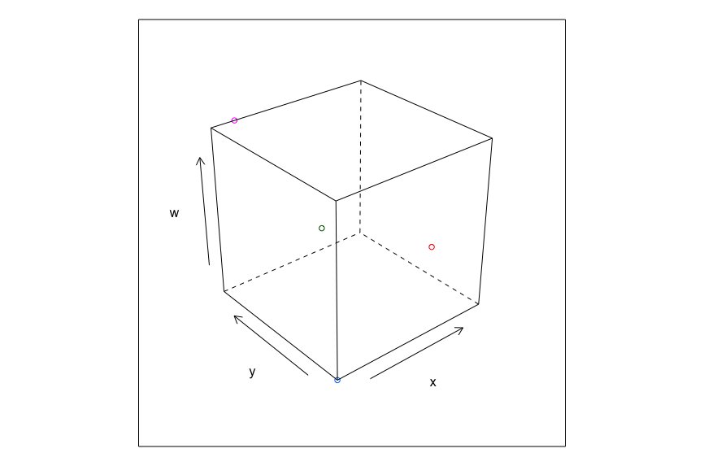
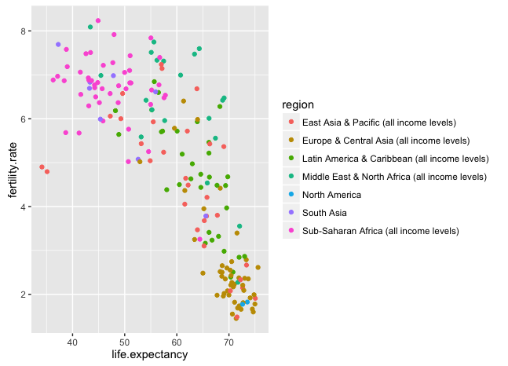

In 2019 I took part in Google Code-in and did a series of tasks for the R Project for Statistical Computing. Here is a quick tour of them.

# *Reading and writing CSV data*  

My first task was about reading a CSV into a data frame, adding rows and columns and writing it back out. You can even read a CSV straight from the internet. [Code](https://github.com/nikh123/code-in)
```
T2 = data.frame(name = c("Nikhil","Roja","Jitendra","Diksha","Krishna"),
                age = c(17,30,21,28,35),
                class = c("2M1","2M2","2M3","2M4","2M5"))
T2$Height = c(140,180,130,120,130)
write.csv(T2, "students.csv")

X = read.csv("https://archive.ics.uci.edu/ml/machine-learning-databases/iris/iris.data", header = FALSE)
head(X)
```

# *Exploring e-commerce data*  

With `dplyr` I explored an e-commerce dataset with 1594 observations and 45 variables. Brisbane had the most visitors among the Australian cities. [Code](https://github.com/nikh123/Exploring-E-commerce-data-Task2-)
```
library(dplyr)
subset(ecommerce, country == "Australia") %>%
  group_by(city) %>%
  summarise(behavNumVisits = sum(behavNumVisits)) %>%
  arrange(desc(behavNumVisits))
```

# *3D scatter plot with Lattice*  

The `cloud` function from `lattice` makes a 3D scatter plot. [Code](https://github.com/nikh123/Data-Visualization-in-R-with-Lattice-Graphics)
```
library(lattice)
Lattice_data = data.frame(w = c(16,90,46,30), x = c(5,10,20,40),
                          y = c(23,89,66,48), z = c("a","b","c","d"))
cloud(w ~ x * y, groups = Lattice_data$z, Lattice_data)
```


# *Interactive plot with animint2*  

Using the WorldBank data I plotted life expectancy against fertility rate in 1975 and turned it into an interactive chart that I published as a gist. [Code](https://github.com/nikh123/Creating-an-interactive-data-visualization-using-animint2)
```
library(animint2)
data(WorldBank, package = "animint2")
WorldBank1975 = subset(WorldBank, year == 1975)
scatter = ggplot() +
  geom_point(mapping = aes(x = life.expectancy, y = fertility.rate, color = region),
             data = WorldBank1975)
animint2gist(animint(scatter))
```


# *R package downloads in 2018*  

The cranlogs API tells you how many times R packages were downloaded. With `jsonlite` I pulled the totals for 2018, and also for each half of the year, and saved them as CSV. [Code](https://github.com/nikh123/Summary-of-R-packages-download-in-2018)
```
library(jsonlite)
Data = fromJSON("https://cranlogs.r-pkg.org/downloads/total/2018-01-01:2018-12-31")
write.csv(Data, "Data.csv")
```

# *A hexagon logo for an R package*  

Every good R package needs a hex sticker! The `hexSticker` package makes one from any image. [Code](https://github.com/nikh123/Creat-a-Hexagone-logo-for-an-R-package)
```
library(hexSticker)
sticker("IMG_0039.png", package = "", p_size = 8,
        s_x = 1, s_y = 1, s_width = .6, filename = "aa.png")
```

